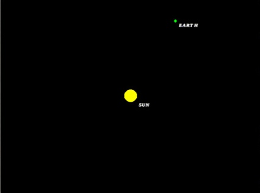
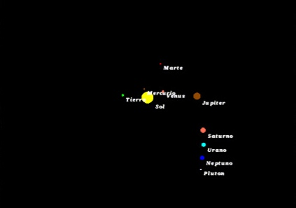

## Trabajo Practico Especial de Automatas, Teoria de Lenguajes y Compiladores. ITBA. 2019-C2 
## Simulador grafico de interaccion fisica entre cuerpos celestes. 

### Toda la informacion para buildear y ejecutar el programa se encuentra en el informe.
  
### Autores: 
- Ail, Brian
- Baader, Juan Martin
- Bergagna, Federico
- Rodriguez Brizi, Manuel

### Ejemplos

